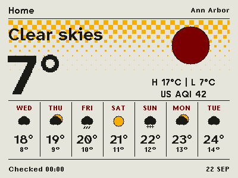

# Weather and news in 0.5.5-weather-news

The weather layout follows the user-supplied [Paperwake](https://github.com/alexclmy/paperwake)
screenshot, using native drawing primitives. It has no calendar panel:
Home and the location sit above current conditions, a large temperature and
weather icon, with today's high/low and units beneath the icon. Seven columns show tomorrow onward, with
weekday, icon, high and low. Current condition and temperature text use solid black. Yellow background
squares connect corner-to-corner at the top and shrink into separated marks
toward the bottom. High and low share one line with a separator.
US AQI appears below today's high/low in the same font size: black through 50, yellow from 51 through 100,
and red above 100. Missing data shows a dash. Weather requests only hourly US AQI from Open-Meteo when Weather is enabled.
The standalone Air screen and its UV, pollen and PM2.5 rendering/data are removed.
Older settings and recipes keep their screen order and Pokémon preferences; Air
selections fall back to Weather, and Air-only setups enable Weather.
The header and footer are both 32 pixels tall. A single-line footer shows the checked time on the left and date on the right; the
on-screen copyright line is removed. Provider attribution remains in the phone
panel and THIRD_PARTY_NOTICES.md.

The existing MET Norway Locationforecast request supplies the forecast without
an API key or backend. Dates use the saved location's time zone. Highs and lows
are estimates over available samples (hourly nearby, usually six-hourly farther
out), including supplied six-hour extrema when that interval fits inside the
local date. Today's values cover the remaining forecast, not observed daily
extremes. Icons use the available interval nearest local noon. Missing days
show dashes; data is not repeated to fill the week.

Weather has one layout regardless of older saved Print/Rhythm/Atlas settings;
composition cycling is disabled for Weather. Existing settings remain valid.
The changed source cache is discarded on upgrade and downloaded again; Wi-Fi
and saved preferences are retained.

News reads RSS descriptions and Atom summaries, with Atom text/HTML content
as a fallback. Markup and script/style content are stripped, text is bounded to
512 UTF-8 bytes, and the screen truncates longer summaries to fit. It does not
fetch article pages. Without a description, the headline remains the fallback.
Print/Rhythm place the summary beneath the headline; Atlas uses two columns.
The phone panel also shows the summary.

<p></p>

## Verification

Run `python3 tools/test_pokemon.py --output-dir /tmp/home-screens-preview`.
This compiles the production parsers and renderer with address/undefined
behavior sanitizers, tests summary formats, forecast day grouping and missing
day rendering, and generates weather/news PNG previews alongside Pokémon.
Preview data is synthetic. A physical display check is still needed after flashing.

Build in an activated ESP-IDF v6.0 environment:

```sh
export IDF_COMPONENT_MANAGER=0
idf.py -C firmware -G Ninja build
```

For a device already running this project's partition layout, update only
`firmware/build/emini_home_g3.bin` at `0x20000`, then verify before restarting.
